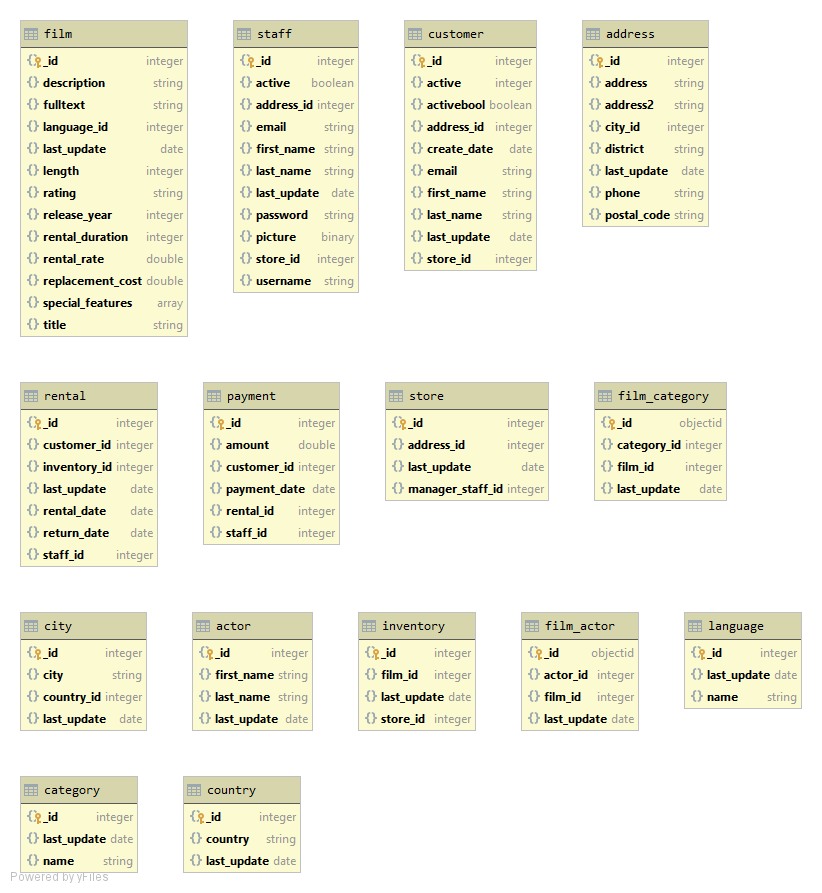

# Data Modelling and Databases II. Migration from RDBMS to MongoDB
## Loading postgresql sample database 
1. Install PostgreSQL server
1. Download the DVD Rental database to any directory, extract it to `~/dvdrental/`
1. Replace all occurences of `$$PATH$$` by `~/dvdrental/` in file `~/dvdrental/restore.sql`
1. Run posgresql server: `sudo service postgresql start`
1. Connect to the server: `sudo -u postgres psql`
1. Create the database: `CREATE DATABASE dvdrental;`
1. Quit psql command line: `\q`
1. Restore the database: `psql dvdrental < ~/dvdrental/restore.sql`
## Designing and creating MongoDB database
#### Decision making
There are two ways to design data models in the MongoDB database:
- Embedded data model (related data is embedded in a single structure or document)
- Normalized data model (references between documents)

The best way would be to combine both embedded and normalized data models, but I'll leave the normalized model as it. The tables have redundant columns (e.g last_update, address2), so it is reasonable to drop some, but we are supposed to move all the data. Embedding such attributes (e.g. categories into films) leads to high memory consumtions.

#### Program description
The python program `migration.py` moves all the data converting:
- tables to collections
- rows to documents 

and making some type conversions:
- numerical -> float
- date -> datetime
- bytea -> bytes 

The program connects to the databases running on the localhost using default port numbers. Then, it executes 15 procedures. Each procedure retrieves all rows from one table (executing SQL command `SELECT * FROM table`) and put them into a collection as documents. All 15 tables are converted into 15 collections. 

#### UML component diagram for the MongoDB database

<!--  -->

## Designing and creating queries

#### Brief description
There is a brief description of queries processing. There are comments in the query sourse files with more detailed explanations.
1. Retrieve all the customers that rented movies of at least two different categories during the current year.
    - calculate the current year
    - select rentals during the current year
    - group by users
    - select only those who have more than 2 categories
2. Create a report that shows a table actor (rows) vs actor (columns) with the number of movies the actors co-starred.
    - select the list of films for each actor
    - for each 2 actors find the length of the set of their common films
3. A report that lists all films, their film category and the number of times it has been rented by a customer.
    - do necessary joins
    - group by films
    - calculate the number of rentals
4. A report that, given a certain customer (parameter) and his/her historical data on rented movies, recommends other movies. Such a recommendation should be based on customers that watched similar sets of movies. Create a metric (any) to assess to which degree a movie is a good recommendation.
    - retrieve ids of all customers and films
    - retrieve all the tuples customer-film
    - create [rating matrix](https://realpython.com/build-recommendation-engine-collaborative-filtering/) with customers as rows, films as columns and with 0's and 1's (1 if a customer has seen a film)
    - apply [content-based collabarative filtering](https://towardsdatascience.com/recommendation-systems-models-and-evaluation-84944a84fb8e), that is for each customer calculate user similarity with the selected customer using [Jaccard similarity index](https://www.statisticshowto.datasciencecentral.com/jaccard-index/)
    - for each films calculate [weighted average](https://en.wikipedia.org/wiki/Weighted_arithmetic_mean) based on the 10 most similar users - it is the metric for recommendation
5. You probably have heard of the “Bacon’s Law” (see link). Create a report that shows the degrees of separation between a certain actor (choose one, this should be fixed) and any other actor.
    - using the result of query 2 constuct the adjacency matrix for actors
    - start breadth first search from selected actors and find distances
    - the distances are degrees of separation

#### Programs description
The programs for executing queries have names `queryN.py` where `N` is the number of a query. After a query execution there will be `N.csv` file created with the query result (csv table).

#### Comments on the performance of the queries
Although MongoDB provides very powerful aggregation framework, the `$lookup` (join) operation might be not so effective as in RDMBS because collections in MongoDB are supposed to be designed to avoid the needs of joins. The execution time for queries is given in the table below. No indices except the default ones (on `_id`) were used.

#### Queries execution time on the local host
| query | 1      | 2      | 3      | 4      | 5      |
|-------|--------|--------|--------|--------|--------|
| time  | 0.156s | 0.372s | 1.097s | 0.962s | 0.176s |